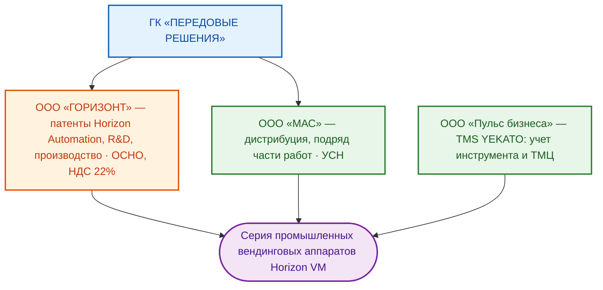

# ПРОЕКТ 12/2025-N4-МАС: ПРОМЫШЛЕННЫЕ ВЕНДИНГОВЫЕ АППАРАТЫ HORIZON VM
**Внутренний R&D-проект · ООО «ГОРИЗОНТ» (ГК «ПЕРЕДОВЫЕ РЕШЕНИЯ»)**
**Заказ №4 рамочного договора 12/2025-N0-МАС (внутренний консалтинг)**

> ⚠️ **Важно:** документ — **строго для внутреннего пользования**. Передача
> сотрудникам вне проектной команды и любые внешние копии запрещены: содержит
> внутренние бизнес-процессы и продуктовые планы.

---

## ОГЛАВЛЕНИЕ

1. [Введение](#1-введение)
2. [Обзор проекта](#2-обзор-проекта)
3. [Структура ИРП](#3-структура-ирп)
4. [Система спецификаций](#4-система-спецификаций)
5. [Направления работ](#5-направления-работ)
6. [Структура документации проекта](#6-структура-документации-проекта)
7. [Дорожная карта и статус](#7-дорожная-карта-и-статус)
8. [Технологический стек · реквизиты](#8-технологический-стек--реквизиты)

---

## 1. ВВЕДЕНИЕ

Проект `12/2025-N4-МАС` — внутренний R&D-проект ООО «ГОРИЗОНТ» по развитию
серии промышленных вендинговых аппаратов и систем хранения **Horizon VM** и
подготовке маркетинговых материалов для заказчиков. Проект является заказом №4
внутри рамочного договора `12/2025-N0-МАС` (внутренний консалтинг в группе
компаний) и финансируется собственными средствами ООО «ГОРИЗОНТ».

Основа АСУ аппаратов — российская универсальная программно-техническая
платформа автоматизации **Horizon Automation** (ООО «ГОРИЗОНТ»), на два
фреймворка которой получены патенты:

- **Horizon Automation Server** — управление контроллерами-хабами;
- **Horizon Automation PLC** — управление программируемыми контроллерами
  полевого уровня АСУ.

Бизнес-модели направления:

1. **OEM** — разработка и производство аппаратов для внешних заказчиков;
2. **Собственное мелкосерийное производство** аппаратов под брендом Horizon VM.

## 2. ОБЗОР ПРОЕКТА



Продуктовая линейка Horizon VM:

| Серия | Тип секций | Модели | Назначение |
| :--- | :--- | :--- | :--- |
| Horizon VM Spiral | спиральные | M96 / A96 / M80 / A80 | автоматизированная выдача упакованного инструмента и ТМЦ; опции: лифт для хрупких ТМЦ, один или два приемных бокса |
| Horizon VM Post | постаматные | M80 / A80 | автоматизированный возврат инструмента/ТМЦ силами оператора; ТМЦ средних и крупных габаритов |
| Horizon VM Hybrid | спиральные + постаматные | M96/50, ME96/35, M80/50, ME80/35 | комбинированное хранение; ME-версии — боксы приема лома и перезаточки со встроенными весами |
| Horizon VM Drum | барабанные | заявлена в линейке | компактное хранение |
| Horizon VM RecPost | пост приема | M3 | прием лома и инструмента на перезаточку: весы, фото/видеофиксация, RFID/QR, интеграция с TMS/ERP заказчика |

Архитектура комплекса: аппарат версии `main` (полноценная АСУ, HMI, три хаба)
плюс до четырех аппаратов версии `additional` (только полевой уровень, без HMI)
по Ethernet через коммутатор main-аппарата — без задействования сети заказчика.

## 3. СТРУКТУРА ИРП

```text
12_2025-N4-МАС\
 01__Документация\        акты, сверки, маркировка, переписка, протоколы, NDA
 02__Спецификации\        01__Заказы · 02__Спецификации (типы 30–90) · 03__ТКП
 03__Проект\              01__ИД · 02__ТЗ · 03__План-график · 04__Документация ·
                          05__Презентация - для заказчиков ·
                          06__Презентация - для инвесторов ·
                          07__Маркировка элементов ПТК ·
                          70__Фото и видео материалы · temp\ ·
                          журнал и промты ai-*.md, переходные документы doc-*.md
 04__Договор\             01__В стадии согласования → 02__Согласованный → 03__Подписанный
 05__Счета\ · 06__Затраты\ · 07__Логистика\
 08__Закрывающие документы\ · 09__Подписанные документы\ · 10__Персонал\
 AGENTS.md                манифест AI-агента (меморандум)
 README.md                настоящий документ
```

## 4. СИСТЕМА СПЕЦИФИКАЦИЙ

Каркас каталогов типов 30–90 развернут в `02__Спецификации\02__Спецификации\`;
на текущую дату ведение спецификаций по проекту не ведется (внутренний проект).
Переходной регламент по работе со спецификациями (типология, семантика полей,
конфиденциальность) будет разработан отдельной задачей в актуальной редакции.

## 5. НАПРАВЛЕНИЯ РАБОТ

1. **Маркетинг для заказчиков (текущий фокус):** презентация серии Horizon VM;
   отраслевые проблематики — дискретное производство, фармацевтика, девелоп;
   целевой каталог — `03__Проект\05__Презентация - для заказчиков\`.
2. **R&D:** развитие модельного ряда серии, документация, маркировка элементов ПТК.
3. **Материалы для инвесторов:** отложенное направление; цели и фокусы будут
   определены отдельно.

## 6. СТРУКТУРА ДОКУМЕНТАЦИИ ПРОЕКТА

### Для пользователей:
- 📘 [Манифест AGENTS.md](./AGENTS.md)
- 📄 Презентации для заказчиков — `03__Проект\05__Презентация - для заказчиков\` *(в работе)*

### Для команды:
- 📄 Исходные данные Horizon Automation — `03__Проект\01__ИД\`
- 📄 Медиатека (фото, видео, 3D-рендеры, логобук) — `03__Проект\70__Фото и видео материалы\`

### Рабочие документы:
- 🔧 Сборник промтов и журнал проекта — [ai-12_2025_n4_мас-marketting.md](./03__Проект/ai-12_2025_n4_мас-marketting.md)
- 🔧 Рабочая дорожная карта (временная) — [work-roadmap.md](./03__Проект/temp/work-roadmap.md)

## 7. ДОРОЖНАЯ КАРТА И СТАТУС

- ✅ Платформа Horizon Automation разработана; фреймворки Server и PLC запатентованы (2024–2025)
- ✅ Исходные данные Horizon Automation (отчеты НИОКТР, протоколы) собраны в `01__ИД`
- ✅ Медиатека проекта собрана (фото, видео, 3D-рендеры, логобук)
- ✅ AGENTS.md и README.md проекта сформированы (07.10.2026)
- 🔄 Презентация для заказчиков по всей серии Horizon VM — **текущий фокус**
- 🎯 Техническое задание, бизнес-план — по отдельным задачам
- 🎯 Материалы для инвесторов — отложенное направление

## 8. ТЕХНОЛОГИЧЕСКИЙ СТЕК · РЕКВИЗИТЫ

- **Документооборот:** Markdown / DOCX / XLSX / PDF в OneDrive; версионирование —
  ревизии в именах файлов (`rev.NN vNN`);
- **Платформа продукта:** Horizon Automation (Server, PLC); TMS YEKATO;
- **Реквизиты:** ООО «ГОРИЗОНТ» — ОСНО, НДС 22% (полные реквизиты — в договорном
  контуре); ООО «МАС» — УСН (без НДС).

---
**Версия документации:** 1.1 (санация ссылок: изъяты устаревшие переходные регламенты)
**Дата актуализации:** 07 октября 2026 г.
